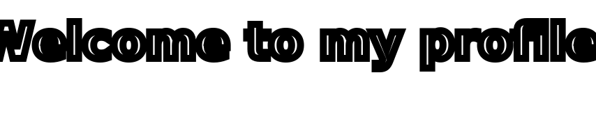

<h2 align="center"><b>#TODO: write your moto here</b></h2>

<!--  DELETE THE LINES BELOW THIS AFTER THIS TODO IS DONE -->
#TODO: proceed with creation of TOKENS
 
  On the new repository `settings->secrets` add your `GIST_SECRET`  

<!--  DELETE THE LINES ABOVE THIS AFTER THIS TODO IS DONE -->
---
# project_name



# Hi there, I'm [author_name](https://github.com/author_name/)! 

>  I'm a ...specializing in ... 
 with over ... years of expertise.
> I'm particularly experienced with ...
> I always love to ... 


<p align="center">
   
  <a href="https://github.com/author_name" target="_blank">
    
  </a>
  <a href="https://twitter.com/author_name">
    
  </a>
  <span>|</span>
  <a href="https://www.linkedin.com/in/author_name">
    
  </a>
  <span>|</span>
  <a href="https://instagram.com/author_name">
    
  </a>
</p>

[](https://app.fossa.io/projects/git%2Bhttps%3A%2F%2Fgithub.com%author_name%2Fproject_name?ref=badge_shield)
[](https://github.com/author_name/project_name/actions/workflows/main.yml)

project_description
 
<div align="center">
    <a href="https://github.com/author_name">
        </img>
    </a>
</div>
 
## 🛠️ Some of Technologies & Tools I use


## 📌 Pinned Repositories

[](https://github.com/author_name/project_name) [](https://github.com/author_name/project_name)

## WakaTime Activity


<p align="center">
  
</p>

## <a href="mailto:author_name@gmail.com" target="blank">📫 Connect with Me</a>

## 📈 My Activity Graph
<table width="100%">
  <thead>
  <!-- Left thead blank intentionally -->
  </thead>
  <tbody>
    <tr>
      <td>
        <a href='https://github.com/author_name?tab=stars'>
          
        </a>
      </td>
      <td>
        <a href='https://github.com/anuraghazra/github-readme-stats'>
          
        </a>
      </td>
    </tr>
  </tbody>
</table>

<div align="center">
  <summary>Stat: GitHub Streak</summary>
  
</div>

<div align="center">
  <summary>Trophy: Github Profile Trophy</summary>
  <a href="https://github.com/ryo-ma/github-profile-trophy"></a>
</div>

<h2 align="center"><b>Metrics</b></h2>

<div align="center">
  <summary>Stat: Github Metrics</summary>
  <a href="https://github.com/author_name/author_name/">
    
  </a>
</div>

<!--  My Home -->
 
My Home: [Here I am](https://geojson.io/#map=1.42/-15.23/167.129)

```geojson
{
  "type": "FeatureCollection",
  "features": [
    {
      "type": "Feature",
      "properties": {},
      "geometry": {
        "coordinates": [
          [
            [
              167.138,
              -15.225
            ],
            [
              167.118,
              -15.21
            ],
            [
              167.148,
              -15.21
            ],
            [
              167.148,
              -15.25
            ],
            [
              167.118,
              -15.26
            ]
          ]
        ],
        "type": "Polygon"
      }
    }
  ]
}
```


[](https://app.fossa.io/projects/git%2Bhttps%3A%2F%2Fgithub.com%author_name%2Fproject_name?ref=badge_large)
<!-- Resources -->
<!-- Icons: https://simpleicons.org/ -->
<!-- GitHub Stats: https://github.com/anuraghazra/github-readme-stats -->
<!-- Emojis: https://emojipedia.org/emoji/ -->
<!-- HTML Emojis: https://www.fileformat.info/index.htm -->
<!-- Shields: https://shields.io/ -->
<!-- Awesome GitHub Profile READMEs: 
https://github.com/abhisheknaiidu/awesome-github-profile-readme 
https://github.com/johnnymillergh/johnnymillergh
-->